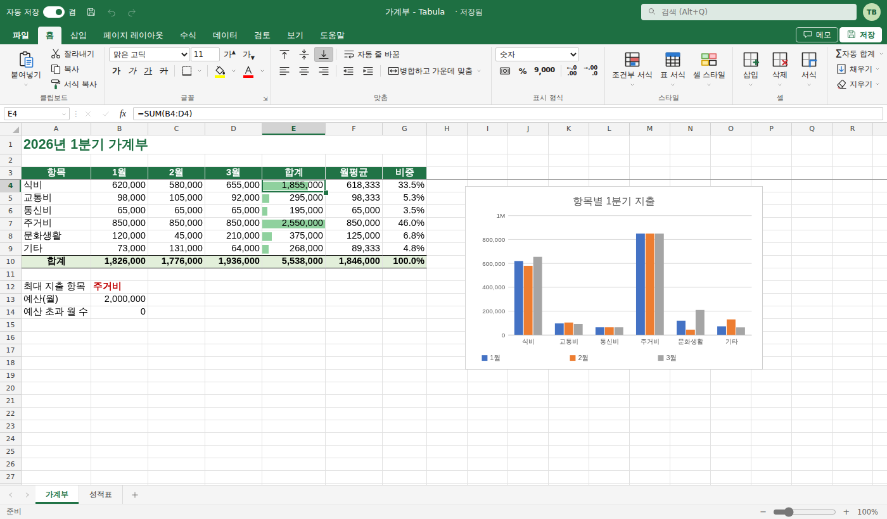

# Tabula — 브라우저용 엑셀 스타일 스프레드시트

엑셀(Microsoft Excel)의 화면 구성과 조작 방식을 그대로 따른 웹 스프레드시트입니다.
외부 라이브러리 없이 순수 HTML/CSS/JavaScript(ES 모듈)로 동작합니다.



## 실행

```bash
cd tabula
npm start          # http://localhost:5178
npm test           # 단위 테스트 (node --test)
```

Node 18 이상이면 됩니다(설치할 패키지 없음).

### 웹에서 접속하기 (설치 없이)

```bash
npm run build      # dist/index.html — CSS·JS 를 모두 넣은 한 파일짜리 배포본
```

- **GitHub Pages**: 저장소 Settings → Pages → Source 를 **GitHub Actions** 로 바꾸면,
  `tabula/` 가 바뀔 때마다 `.github/workflows/tabula-pages.yml` 이 테스트 → 빌드 → 배포합니다.
  주소는 `https://<계정>.github.io/<저장소>/` 입니다.
- `dist/index.html` 은 어떤 정적 호스팅(Netlify, Cloudflare Pages, S3 등)에 올려도 되고, 파일을 더블클릭해 열어도 동작합니다.
- 정적 배포본에서는 문서가 그 브라우저(localStorage)에 저장됩니다. 다른 기기와 공유하려면 `.xlsx` 로 내려받아 옮기거나,
  아래처럼 `npm start` 서버를 인터넷에 공개하세요.

### 다른 기기에서 같은 문서 열기

`npm start` 로 실행하면 문서가 **서버의 `data/` 폴더에 자동 저장**되고, 같은 네트워크의 다른 기기(휴대폰·다른 PC)에서
터미널에 표시되는 주소(예: `http://192.168.0.10:5178`)로 접속해 **파일 → 열기** 에서 같은 문서를 열 수 있습니다.

| 환경 변수 | 설명 |
|-----------|------|
| `PORT` | 포트 (기본 5178) |
| `HOST` | 접속 허용 주소. 기본 `0.0.0.0`(같은 네트워크 허용), `127.0.0.1` 이면 이 컴퓨터에서만 |
| `TABULA_DATA` | 문서 저장 폴더 (기본 `tabula/data`) |
| `TABULA_TOKEN` | 설정하면 저장소 사용 시 이 암호가 필요 |

`index.html` 을 다른 정적 서버로 열어도 동작하며, 이 경우 문서는 브라우저(localStorage)에만 저장됩니다.
어느 경우든 **파일 → 다른 이름으로 저장** 에서 `.xlsx` 로 내려받아 엑셀에서 그대로 열 수 있습니다.

## 주요 기능

| 영역 | 내용 |
|------|------|
| 시트 크기 | **10,000,000행** × 16,384열(XFD) — 엑셀(1,048,576행)의 약 10배. 화면에 보이는 부분만 그리는 가상 스크롤이라 큰 파일도 부드럽게 스크롤. `.xlsx` 로 저장할 때는 엑셀 한도를 넘는 행이 빠지므로(경고 표시) 전체는 `.tabula` 로 저장 |
| 화면 | 제목 표시줄(자동 저장, 저장 상태), 리본(파일·홈·삽입·페이지 레이아웃·수식·데이터·검토·보기·도움말), 이름 상자, 수식 입력줄, 시트 탭, 상태 표시줄(평균·개수·합계, 확대/축소, Ctrl+휠) |
| 입력 | 셀에 바로 입력, F2/더블클릭 편집, Tab→Enter 시 시작 열로 복귀, Alt+Enter 줄 바꿈(행 높이 자동 맞춤), Ctrl+Enter 일괄 입력, 한글 IME |
| 수식 | 상대/절대 참조(F4), 다른 시트 참조, 열 참조(`A:A`), 순환 참조 감지, 셀 클릭·방향키로 참조 삽입, 함수 자동 완성, 긴 참조 사슬(누계 수만 행)도 계산 |
| 함수 | SUM, SUBTOTAL, AVERAGE, COUNTIF(S), SUMIF(S), IF/IFS/IFERROR, VLOOKUP/XLOOKUP/INDEX/MATCH, STDEV/VAR, 텍스트·날짜·수학 함수 등 90여 개. TEXT() 는 사용자 지정 서식 코드를 그대로 지원 |
| 서식 | 글꼴·색·테두리·맞춤·병합, 표시 형식, 서식 복사, 셀 스타일, 표 서식, 조건부 서식(강조 규칙·상위 규칙·데이터 막대·색조), 열/행 전체 서식 |
| 틀 고정 | 틀 고정 / 첫 행 고정 / 첫 열 고정 (보기 → 틀 고정) |
| 필터 | 자동 필터(Ctrl+Shift+L): 값 목록 체크·검색, 정렬, 여러 열 조건, 지우기/다시 적용 |
| 숨기기 | 행·열 숨기기/숨기기 취소 (Ctrl+9 / Ctrl+0, 머리글 오른쪽 클릭) |
| 차트 | 세로·가로 막대형, 꺾은선형, 영역형, 원형, 도넛형, 분산형. 데이터가 바뀌면 자동 갱신, 끌어서 이동·크기 조절, 더블클릭으로 편집 (Alt+F1) |
| 그림·도형 | 그림 삽입(파일 선택·붙여넣기·끌어 놓기), 도형(사각형·둥근 사각형·타원·삼각형·화살표·선)과 텍스트 상자 그리기, 이동·크기 조절(그림은 비율 유지), 글자·채우기·윤곽선 서식, 맨 앞/맨 뒤, 복사·붙여넣기 |
| 데이터 유효성 검사 | 목록(드롭다운, 범위 참조 가능)·정수·소수·날짜·시간·텍스트 길이·사용자 지정 수식, 설명 메시지, 오류 메시지(중지·경고·정보), 잘못된 데이터 표시 |
| 매크로 | `.xlsm` 의 VBA 코드 보기(보기 → 매크로). 보안을 위해 **실행하지는 않으며**, `.xlsm` 으로 다시 저장하면 매크로가 그대로 보존됨 |
| 표 (Ctrl+T / Ctrl+L) | 머리글·필터 단추·줄무늬 스타일 21종, **아래·오른쪽에 입력하면 자동 확장**(계산 열 수식·서식 이어받기), 계산 열(열에 수식 하나 넣으면 전체 채움), 요약 행(SUBTOTAL: 필터된 행 제외), 구조적 참조 `표1[금액]` `[@수량]` `표1[#모두]`, 표 이름·크기 조정·범위로 변환, [테이블 디자인] 탭 |
| 슬라이서 | 표와 피벗 테이블용. 항목을 눌러 필터, Ctrl+클릭·다중 선택, 데이터 없는 항목 표시, 필터 지우기, 열 수·색 설정, 끌어서 이동·크기 조절 |
| 텍스트 나누기 (Alt+A+E) | 3단계 마법사: 구분 기호(탭·세미콜론·쉼표·공백·기타, 연속 구분 기호, 텍스트 한정자) 또는 너비 일정(클릭해 구분선), 열 서식(일반·텍스트·날짜 YMD/MDY/DMY…·건너뜀), 대상 셀 |
| 셀 서식 (Ctrl+1) | 표시 형식(일반·숫자·통화·회계·날짜·시간·백분율·분수·지수·텍스트·기타·**사용자 지정**), 맞춤, 글꼴, 테두리, 채우기. 사용자 지정 서식 코드: `#,##0,"천원"` `[빨강]` `[>=100]` `양수;음수;0;텍스트` `@"님"` `yyyy-mm-dd aaaa` `[h]:mm` `# ?/?` `000-0000-0000` 등 |
| 피벗 테이블 | 행/열/값 필드와 합계·개수·평균·최대·최소. 새 시트에 만들고 [데이터 → 모두 새로 고침]으로 갱신. **표 이름을 원본으로 쓰면** 표에 쌓인 데이터가 새로 고칠 때 자동 포함, 슬라이서로 필터 |
| 편집 | 복사/붙여넣기(값·수식·서식·행/열 바꿈, 외부 표), 채우기 핸들, 행·열 삽입/삭제(참조 자동 조정), 정렬, 중복 제거, 찾기/바꾸기, 메모, 실행 취소 |
| 파일 | **.xlsx / .xlsm 열기·저장**(값·수식·서식·사용자 지정 서식·병합·틀 고정·필터·숨김·조건부 서식·메모·차트·그림·도형·데이터 유효성 검사·표·매크로 포함), CSV 가져오기/내보내기, 서버·브라우저 자동 저장, 인쇄 |

## 구조

```
tabula/
├── index.html · styles.css
├── server.js          # 정적 파일 + 문서 저장 API (/api/files)
├── build.mjs          # 한 파일짜리 배포본(dist/index.html) 만들기
├── src/
│   ├── formula.js     # 수식 엔진: 토크나이저·파서·평가기·함수·참조 재작성
│   ├── workbook.js    # 통합 문서 모델: 셀·재계산·실행 취소·구조 변경·병합·필터·차트 정보
│   ├── format.js      # 표시 형식, 입력값 해석
│   ├── axis.js        # 행/열 위치 계산 (가상 스크롤)
│   ├── view.js        # 가상 스크롤 그리드 그리기 (틀 고정 4개 창)
│   ├── app.js         # 선택·편집·키보드/마우스·명령
│   ├── xlsx.js        # .xlsx 읽기/쓰기
│   ├── zip.js · xml.js  # ZIP(inflate 포함)·XML — xlsx 용, 직접 구현
│   ├── chart.js       # 차트 데이터 해석·SVG
│   ├── shapes.js      # 그림 개체 공통 · 도형 SVG
│   ├── tables.js      # 표: 스타일 · 구조적 참조 · 자동 확장
│   ├── textsplit.js   # 텍스트 나누기 (구분 기호 · 너비 일정 · 날짜 순서)
│   ├── fmtpresets.js  # 셀 서식 대화상자 범주 · 서식 코드
│   ├── validation.js  # 데이터 유효성 검사 규칙 판정
│   ├── vba.js         # vbaProject.bin(OLE) 읽기 · VBA 코드 압축 해제
│   ├── pivot.js       # 피벗 테이블 계산
│   ├── storage.js     # 서버 저장소 클라이언트
│   ├── series.js · csv.js · ribbon.js · ui.js · icons.js · funcinfo.js · samples.js
└── test/              # node --test 단위 테스트
```

## 제한 사항

- 여러 기기에서 **동시에** 같은 문서를 고치면 마지막에 저장한 내용이 남습니다(실시간 공동 편집은 지원하지 않음).
- 서버 저장소는 같은 네트워크 사용을 전제로 합니다. 인터넷에 공개할 때는 `TABULA_TOKEN` 과 HTTPS 프록시를 함께 사용하세요.
- 피벗 테이블은 계산 결과를 시트에 적는 방식이라, 원본이 바뀌면 [모두 새로 고침]을 눌러야 합니다. xlsx 로 저장하면 값으로 저장됩니다.
- 매크로(VBA)는 코드를 보고 보존만 하며 실행하지 않습니다.
- 슬라이서는 .tabula 에만 저장되고 .xlsx 로 저장하면 빠집니다(표·필터 상태는 저장됨).
- 브라우저 탭에서는 Ctrl+T 가 '새 탭'으로 먼저 처리될 수 있어 같은 기능을 Ctrl+L 에도 연결했습니다.
- 표 머리글(열 이름)을 바꾸면 그 이름을 쓰던 구조적 참조는 자동으로 바뀌지 않습니다(표 이름 변경은 반영됨).
- 도형은 기본 모양(사각형·타원·삼각형·화살표·선·텍스트 상자)으로 가져오며, 그 밖의 모양은 사각형으로 표시합니다. 스마트아트·스파크라인·피벗 캐시는 가져오지 않습니다.
- 지원하지 않는 함수가 들어 있는 수식은 계산된 값으로 가져옵니다.
- 정적 배포본(GitHub Pages 등)의 브라우저 저장 공간은 보통 5MB 입니다. 큰 그림이 많으면 파일로 저장하세요.
