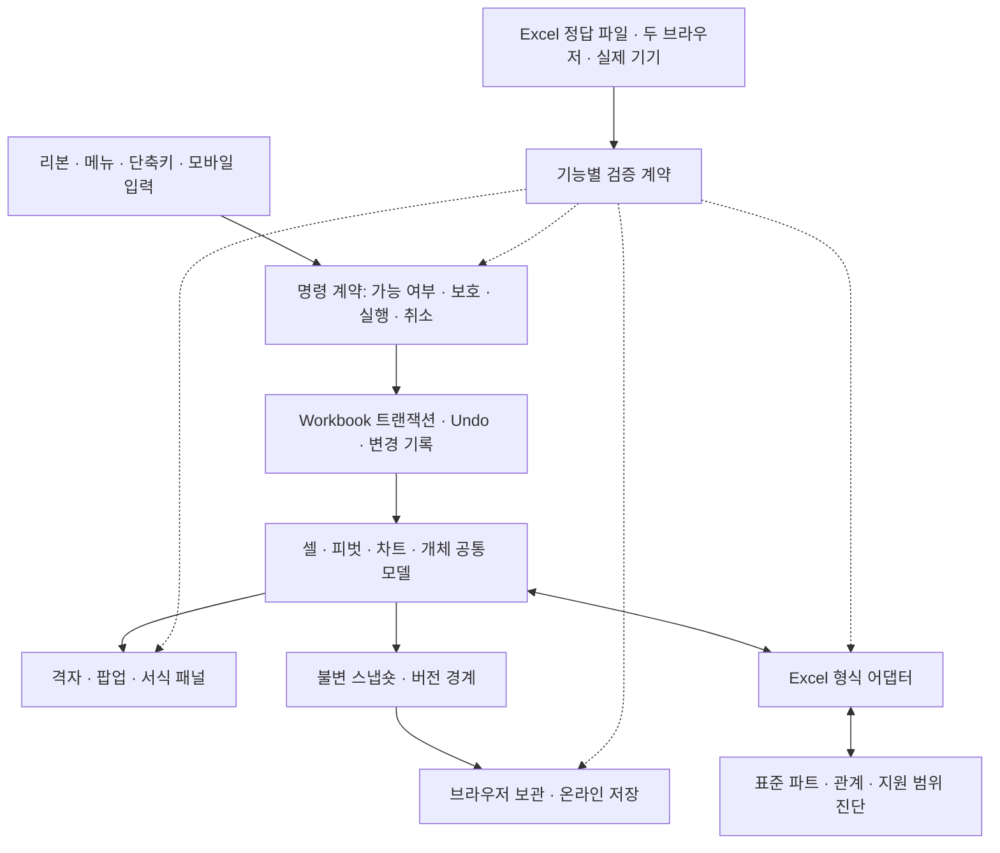

# 63. 위셀 개선 기획과 설계

작성: 2026-10-03. 기준 `31bc9009914be91eefded3dcf876c34dea99d0df`. **제품 코드 수정 전에 작성한 계획**이다. 후속 완료 결과는 `64_개선실행과검증.md`에 기록한다.

## 평가 기준과 점수

현재 **60/100(59.6 반올림)**으로 평가한다. 기능 지원률이 아닌 엔지니어링 성숙도 평가다. Excel 전체 기능의 유한한 분모나 독립 사용자 연구가 없어 “Excel의 60% 구현”으로 해석하면 안 된다. docs30의 개인 Excel 업무 가중치를 유지하지만 과거 추정 범위 중간값과 작은 점수 차이를 개선률로 해석하지 않는다.

단계: 0 없음, 1 제한된 시범, 2 부분 업무 가능, 3 주요 업무와 회귀 검증, 4 폭넓은 범위와 다환경/실제 Excel 근거, 5 정의한 필수 과제 전체를 대상 환경·오류·복구 조건까지 검증. 0.5 단위 중간값 허용. 미검증은 결함으로 단정하지 않고 만점의 제한으로 반영한다.

| 평가 영역 | 가중치 | 성숙도 /5 | 환산 점수 | 주요 한계 |
|---|---:|---:|---:|---|
| 셀 편집·서식·계산 | 18 | 3.5 | 12.6 | 반복 계산·표시 정밀도·동적 데이터 표 |
| 파일 가져오기·Excel 왕복 | 20 | 3 | 12.0 | 차트 전용 시트·일부 구형 수식·파트 손실 |
| 표·필터·피벗·분석 | 14 | 3.5 | 9.8 | 외부 OLAP/DAX/Power Query 전체 엔진 |
| 차트·그림·도형·출력 | 12 | 3.5 | 8.4 | 로그 축, native SmartArt, 고급 인쇄 |
| 저장·버전·복구 | 10 | 3.5 | 7.0 | 전체 스냅숏 비용·큰 문서 이력·일부 보호 경로 |
| 공동 작업·검토 | 4 | 1 | 0.8 | 셀 동시 병합·역할별 댓글 미지원 |
| 자동화·외부 서비스 | 10 | 1 | 2.0 | VBA 실행·비공개 Sheets OAuth 미지원 |
| 대용량 응답성 | 6 | 3 | 3.6 | 긴 동기 계산/직렬화·중복 렌더 |
| 모바일·입력·접근성 | 4 | 3 | 2.4 | 실제 iPhone Bluetooth·OS 종료·VoiceOver 미검증 |
| 보안·운영 | 2 | 2.5 | 1.0 | 기기 회수·비용 관제·독립 복구 훈련 |

근거는 [30 재평가](30_재평가와품질개선.md), [54 기능 감사](54_전체기능과Excel설정감사.md), [58 스타일](58_개체스타일과모바일목록.md), [60 필터 단추](60_필터단추와표시상태보존.md), [61 시트 안정성](61_아이폰홈화면시트조작.md), [62 외부 키보드](62_모바일외부키보드입력.md)와 현재 소스다. 기준 릴리스의 Node 1,147개와 명령 smoke 386개는 검증 사례이지 전체 동등성 분모가 아니다. 새 측정: src JS 158개, app.js 20,216줄, xlsx.js 5,070줄, Node 검사 파일 139개, 도구 136개.

## 부족한 점과 완료 조건

P0: 광범위 자료 유실/권한 문제. P1: 값·파일 손실 위험이나 일상 작업 장애. P2: 독립적인 범위 확장. 상태는 확정 결함/부분·미지원/미검증으로 구분한다.

| ID | 우선순위·상태 | 문제와 코드 근거 | 완료 조건 |
|---|---|---|---|
| CMD-01 | P1·재현 | app.js repeatLast가 COMMANDS를 직접 호출해 F4로 구조 보호 우회 | run의 동일 보호/문맥 검사를 통과한 명령만 반복. 보호 전후·Undo·정상 반복 UI 검증 |
| SAVE-01 | P1·코드 확인 | remoteConflict의 다시 열기가 libraryFlush 실패/null을 무시 | 현재 사본 보존 실패 시 온라인 교체 금지. 성공/실패/문서 전환 합성 검사 |
| IO-01 | P1·재현 | xlsxOverflow가 셀 맵만 세어 행 한도 밖 블록을 경고 없이 제외 | 일반 셀+열 블록 한도 검사. 끝 행·중첩·희소 블록·취소·파일 불변 |
| IO-02 | P1·재현 | dataTable 수식이 경고 없이 일반 값으로 변함 | 먼저 계산 미지원과 재저장 손실 명시. 표준 원형/관계/구조 변경 정책 및 TABLE 엔진은 별도 단계 |
| CHART-01 | P1·재현 | logBase 누락, 로그 축을 선형 축으로 렌더 | 우선 무경고 변환 차단. 축 모델·양수 도메인·눈금·표준 왕복·패널·실제 Excel 좌표 비교를 함께 구현 |
| PERF-01 | P1·확정 비용 | libraryFlush의 wb.serialize→JSON.stringify 전체 복제 | 불변 Blob 조각 직렬화로 셀 사전 복제 제거. JSON 동일·충돌/실패/복구 유지·전후 시간/메모리 측정 |
| IO-03 | P1·부분 | 차트 전용 시트 제외·구형 미해석 수식 값으로 축소 | 열기부터 저장까지 손실 진단 유지. 관계까지 보존하고 구조 변경 시 정책 명시 |
| CALC-01 | P1·부분 | iterate/fullPrecision은 속성만 보존 | 수렴/오류/반올림 시점 설계 후 실제 Excel 정답집 대조 |
| UX-01 | P1·미검증 | 실제 iPhone Bluetooth/한글/가상 키보드·OS 종료 | Safari/설치 앱·회전·마우스/터치·외부/화면 키보드 실기기 과제와 OS 로그 |
| UX-02 | P1·부분/미검증 | 좁은 메뉴와 접근성, 보조기술 미검증 | 촘촘/터치 배치 모두 초점·읽기 순서·대체 조작 검사, VoiceOver/NVDA 업무 완료 |
| ARCH-01 | P1·구조 공백 | 명령·리본·보호·키팁·문맥 메뉴 분산 | 안정 기능 ID와 가능 여부/실행/취소/Undo/입출력/검사 계약 연결 |
| IO-04 | P1·부분 | 직접 생성/가져오기 경로별 옵션 검증 편차 | 같은 내용의 직접 생성/Excel 원본/왕복 3종에 같은 모델·화면 assertion |
| PERF-02 | P1·부분 | 긴 동기 계산/저장·중복 렌더 | 5천/5만/20만/100만 셀 유형별 p50/p95·취소·메모리 기준 |
| SAVE-02 | P1·부분 | 대용량 이력·오프라인 재실행·용량 정리 | 세대별 이력/용량 정책, 오프라인 앱 셸 업데이트/rollback, 실제 복구 |
| PRINT-01 | P2·부분 | 고급 인쇄 설정·검색 가능한 PDF·실물 인쇄 | 표준 왕복·한글 검색/글꼴·페이지 경계·프린터 비교 |
| DRAW-01 | P2·부분 | 일반 그룹 SmartArt와 native dgm 차이 | 객체 관계/연결점/레이아웃과 외부 편집 왕복 |
| DATA-01 | P2·미지원 | OLAP/DAX/Power Query 전체 | 커넥터/변환/계산 범위를 정하고 권한·갱신·취소·정답집 구현 |
| AUTO-01 | P2·미지원 | VBA 실행·비공개 Sheets 연결 | 격리·권한·중단·지원 언어 계약. 보존과 실행 구분 |
| COLLAB-01 | P2·미지원 | 셀 단위 동시 병합·계정 역할 | 충돌/구조 편집/오프라인 재접속/서버 권한 검증 |
| OPS-01 | P1·부분 | 기기 회수·남용 비용 경보·장기 복원 | 키 교체·용량 지표·권한 회수·독립 백업 복구 훈련 |

추가 읽기/재현 감사 결과를 우선순위 목록에 연결한다.

| ID | 상태·다음 설계 | 종료 조건 |
|---|---|---|
| UX-03 | P1·재현: 모바일 gridView 초점에서는 native copy/paste가 무시됨. 사용자 추가 보고는 **위셀 셀→셀 Ctrl+C/V** | 내부 복사본의 바로 가기 경로, native 중복 방지, 편집/조합은 기존 경로, 외부 앱 복사본과 구분. 양 엔진 회귀 후 실제 iPhone 검수 |
| SAVE-03 | P1·재현: 열 블록이 들어간 기존 JSON 보관본은 typed array가 숫자 키 객체가 되어 `.slice` 복원 오류 | 기존 JSON/새 Blob의 0·NaN 빈칸·정렬·문자·논리/오류·Undo 복원 |
| UX-04 | P1·재현: 모바일 탐색 초점에 논리 격자 활성 셀 ARIA 연결 누락 | 초점 소유자/논리 격자 통합, 입력 모드 전환 및 VoiceOver 확인 |
| UX-05 | P1·재현: 선택 창 행 키보드 선택/이름 바꾸기 경로 없음 | 행 탐색/복수선택/F2/취소/보호/Undo |
| UX-06 | P1·재현: 상태표시줄 복사 실패도 성공 토스트, 키보드 진입 없음 | 쓰기 결과 기반 안내와 버튼 의미, 권한 거부/API 없음/성공 검사 |
| QA-01 | P1·코드 확인: functional-audit resume은 도구 해시 미대조, sourceChanged/관찰 오류가 pass에 미반영 | 도구·fixture·엔진/옵션·제품/자산 해시로 재사용 제한, 소스 변화·오류 통과 금지 |
| IO-05 | P1·부분: 큰 피벗 캐시 판독 한도와 숨김 출처 모호성 | 한도 사유 진단·캐시/원본 불일치 비교, 수동/필터 숨김 출처 계약 |

점수는 이번에 추가로 재현한 보호·손실·저장 결함까지 반영한 기준 평가다. 첫 문서 작성 후 감사 결과로 보완했으며, 패치로 해결한 좁은 사례를 전체 영역 개선으로 가산하지 않는다. UI·개별 회귀가 있는 것과 전체 영역의 일관성을 구분한다. 첫 배치에 UX-03과 SAVE-03을 추가하고, 나머지 신규 항목은 2~4단계에 둔다.

필터 단추의 조건 보존, 피벗 보고서 필터, 스타일 갤러리 등 이미 수정/검증한 항목을 다시 미지원으로 나열하지 않는다. 실제 iPhone 홈 이탈은 아직 원인 확정이나 해결 완료로 표시하지 않는다.

## 설계도

의존성 없는 ES 모듈과 named import 빌드를 유지한다. 큰 app.js를 일괄 재작성하지 않고 결함이 발생한 영역부터 순수 모델·직렬화·명령 어댑터로 분리한다. Workbook.transact, 문서/버전 guard, 보호, Undo를 공통 계약으로 유지한다.

기능 계약은 ID, Excel 대응, 지원/제한, canExecute, 모델/표시 변화, 취소/Undo, 표준 읽기/쓰기 속성, 검사 도구/환경/소스 revision을 연결한다. 검사 상태는 미실행/통과/실패/환경없음으로 나누며 미실행을 성공으로 세지 않는다.

파일 계약은 읽기→모델→편집→표준 저장→실제 Excel 재열기→재읽기다. 편집 가능/원형 보존만/표시 근사/누락 위험을 구분한다. 장기적으로 진단을 모델에 남겨 저장 전에도 보여준다. 미지원 XML을 무조건 삽입하지 않고 관계 ID·이름/구조 편집 후 재작성 또는 편집 제한을 설계한다.

## 첫 개선 배치 세부 설계

1. CMD-01: 반복 명령은 실행 closure 대신 run 진입을 재사용한다. 현재 보호/읽기 전용/선택/피벗 잠금을 다시 확인한다. 반복 기록 재설정·재귀·메시지 중복을 피한다.
2. SAVE-01: 온라인 재열기 전 기존 preserveRecoverySnapshot과 context guard를 적용한다. null을 성공으로 처리하지 않는다. 큰 문서 복구가 준비되지 않으면 교체를 멈추고 파일 보관 안내를 한다.
3. IO-01/02·CHART-01: 재현 fixture를 먼저 고정하고 무경고 손실부터 막는다. 경고 추가를 TABLE/로그 축 엔진 구현 완료라고 세지 않는다.
4. PERF-01: 문서 교체 전에 **동기적으로** 스냅숏을 고정하는 계약은 유지한다. cellData와 시트 속성 목록을 공유하고 전체 셀 사전·블록 복사를 제거한 저장 view를 JSON 조각/Blob으로 즉시 고정한다. 문자열·유니코드·NaN·생략 의미는 native JSON과 같다. library.js는 기존 문자열과 불변 Blob을 받아 같은 gzip JSON·원자 transaction·revision 검사로 저장한다. 충돌 사본은 원래 스냅숏의 ID만 교체하고 현재 Workbook를 재조회하지 않는다.
5. 단일 거대 속성/그림 문자열, 동기 전체 순회는 첫 메모리 개선 뒤에도 남는다. 후속 작업 로그/불변 데이터 단위와 취소 가능한 비동기 저장이 필요하다. 자동 보관을 끄거나 자료를 생략해 얻은 속도를 개선으로 세지 않는다.

## 순서와 재평가 조건

| 단계 | 작업 | 종료 기준 |
|---|---|---|
| 0 | 평가·재현·본 계획 | 코드/검증 근거와 미지원·미검증 구분 |
| 1 | CMD-01, SAVE-01, IO-01/02, CHART-01의 손실 안내, PERF-01 | 보호 우회·실패 후 교체·무경고 잘림 방지, 원본 불변, 내용 동일·관련 회귀 |
| 2 | ARCH-01/IO-04 | 명령별 실제 결과·취소·보호·Undo·저장 추적 |
| 3 | IO-03/CALC-01/로그 축 엔진 | 실제 Excel 정답/왕복과 진단 보존 |
| 4 | UX/PERF/SAVE 확장 | 실제 기기·보조기술·고정 성능/복구 과제 |
| 5 | PRINT/DRAW/DATA/AUTO/COLLAB/OPS | 지원 범위/권한 모델 확정 후 독립 회귀 |

75점 목표는 주요 개인 업무의 파일·입력·복구 P1을 닫은 뒤 재평가한다. 85점은 대상 기기와 주요 파일 왕복 계약, 90점 이상은 자동화·외부 데이터·협업의 정의된 필수 범위도 요구한다. 100점은 유한한 요구 목록·대상 Excel 버전·기기·파일 집합을 명시하고 모두 통과했을 때 그 범위에 한해서만 말한다. 패치/검사 개수마다 점수를 자동 가산하지 않는다.

## 연구 근거

- [Microsoft: 브라우저와 Excel 차이](https://support.microsoft.com/en-us/excel/differences-between-using-a-workbook-in-the-browser-and-in-excel): 비교 버전/환경을 구분한다. 웹이라는 이유로 반복 계산 같은 누락을 정당화하지 않는다.
- [Microsoft: CalculationProperties](https://learn.microsoft.com/en-us/dotnet/api/documentformat.openxml.spreadsheet.calculationproperties?view=openxml-3.0.1): 속성 보존과 실행의 차이를 확인하는 표준 근거.
- [W3C: WCAG 2.2](https://www.w3.org/TR/WCAG22/): 좁은 메뉴도 키보드·초점·목표 크기·대체 조작을 검증한다. 픽셀 크기만으로 준수 인증하지 않는다.
- [Apple: Jetsam 보고서 분석](https://developer.apple.com/documentation/xcode/identifying-high-memory-use-with-jetsam-event-reports): OS 종료와 웹 오류를 분리한다. 메모리 최적화만으로 iPhone 종료 원인을 확정하지 않는다.

공식 문서 확인일 2026-10-03. 위셀 지원 판단은 소스/재현에 근거한다. 사용자 사적 원본·문서 내용은 보고서/저장소에 넣지 않는다.
